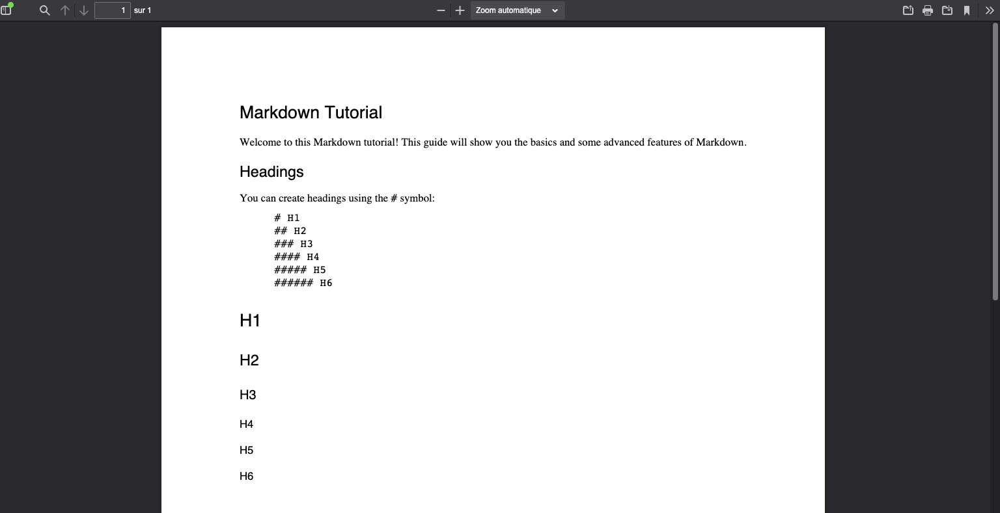
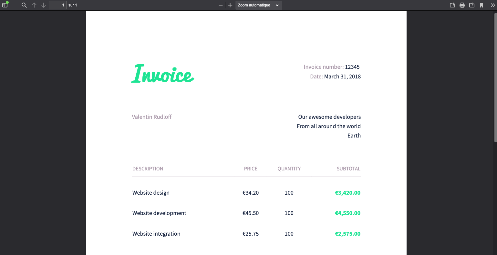
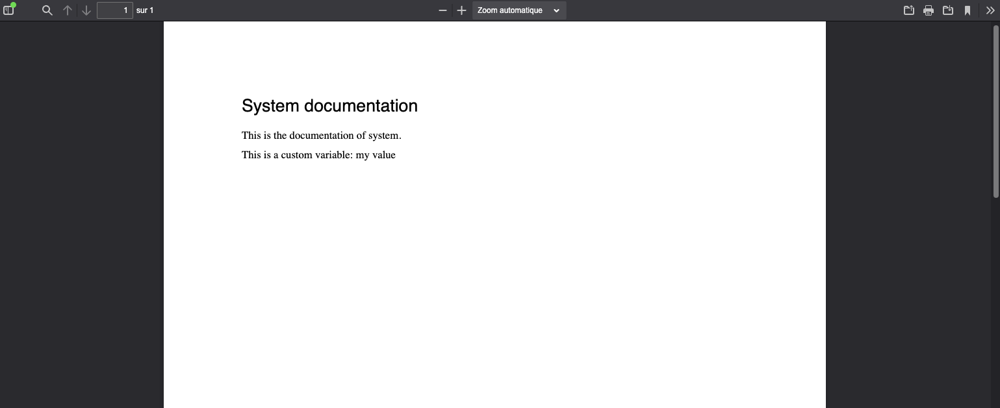

### Description

AIOP allows you to generate PDFs from HTML or Markdown.

### Import Statements

```javascript
import { Callout } from "nextra-theme-docs";
import { FileTree } from 'nextra/components'
```

### PDF Generation

AIOP enables you to generate PDFs from HTML or Markdown.

#### From Markdown

AIOP uses the tool [mdpdf](https://github.com/elliotblackburn/mdpdf/tree/master) for generating a PDF from a Markdown file.

Generating a PDF from Markdown is the simplest method; you only need to know the basics of Markdown. However, the document's format cannot be modified (see generation from [HTML](#from-html)).

Here is an example of a PDF generated from Markdown:


You can combine Markdown files to create a single PDF. Each Markdown file will be separated by a page break.

#### Markdown Syntax

To learn how to write Markdown, you can refer to [this page](https://www.markdownguide.org/basic-syntax/).

Take the example of the PDF generated above. The content of this Markdown is as follows:

```markdown
# Markdown Tutorial

Welcome to this Markdown tutorial! This guide will show you the basics and some advanced features of Markdown.

## Headings

You can create headings using the `#` symbol:

```markdown
# H1
## H2
### H3
#### H4
##### H5
###### H6
```

# H1
## H2
### H3
#### H4
##### H5
###### H6
```

#### Declaration

AIOP generates a PDF from Markdown if you declare a resource whose source has a `.md` (Markdown) extension and the destination has a `.pdf` (PDF) extension. Here is an example of declaring the resource.

```yaml
- source: mymarkdown.md
  destination: mypdf.pdf
```

After generating the package, the file `mypdf.pdf` will be created in the package's root folder.

To generate a PDF from multiple Markdown files, you can declare them as follows:

```yaml
- source: mymarkdown.md | myothermarkdown.md
  destination: mypdf.pdf
```

The file `mypdf.pdf` will be created in the package's root folder and contain the content of the two Markdown files separated by a page break.

## From HTML

To generate a PDF from HTML, AIOP uses the tool [weasyprint](https://weasyprint.org/). This allows you to generate PDFs with custom CSS and fonts.

Here is an example of a PDF generated from HTML:



<Callout type="info" emoji="ℹ️">
  In order to use Weasyprint you must install [weasyprint and its libraries](https://doc.courtbouillon.org/weasyprint/stable/first_steps.html#installation).
</Callout>

### HTML and CSS Syntax

You need to know the basics of HTML and CSS to generate PDFs from HTML. However, there are already examples of PDFs available [here](https://github.com/CourtBouillon/weasyprint-samples/).

### Declaration

AIOP generates a PDF from a resource whose source has a `.html` (HTML) extension or a folder containing a `.html` file, and the destination has a `.pdf` (PDF) extension. Here is an example of declaring the resource.

The content of the playbook is as follows:

<FileTree>
  <FileTree.Folder name="playbook" defaultOpen>
    <FileTree.Folder name=".git">
        <FileTree.File name="..." />
    </FileTree.Folder>
    <FileTree.File name=".aiop" />
    <FileTree.File name="invoice.aml" />
    <FileTree.Folder name="invoice" defaultOpen>
        <FileTree.File name="invoice.html" />
        <FileTree.File name="invoice.css" />
        <FileTree.File name="pacifico.ttf" />
        <FileTree.File name="sourcesanspro-bold.otf" />
        <FileTree.File name="sourcesanspro-regular.otf" />
    </FileTree.Folder>
  </FileTree.Folder>
</FileTree>

The declaration is as follows:

```yaml filename="invoice.aml"
- source: invoice/invoice.html
  destination: invoice.pdf
```

<Callout type="info" emoji="ℹ️">
  In this case, only the `.html` file is declared. This means the HTML format will be basic, and the fonts will be system default fonts.
</Callout>

It is possible to generate a PDF from a folder containing HTML and CSS files. Here is an example of declaring the resource. If the HTML and CSS files are in the folder, AIOP will return an error.

```yaml filename="invoice.aml"
- source: invoice/
  destination: invoice_folder.pdf
```

It is also possible to generate a PDF from a list of files including an HTML file and a CSS file. Here is an example of declaring resources.

```yaml filename="invoice.aml"
- source: invoice/invoice.html & invoice/invoice.css & invoice/pacifico.ttf & invoice/sourcesanspro-bold.otf & invoice/sourcesanspro-regular.otf
  destination: invoice_merged.pdf
```

### Advanced Functions

It is possible to combine PDF generation with an FMPP ([learn more](/docs/integrations/templating/fmpp)) or Jinja ([learn more](/docs/integrations/templating/jinja)) template. This means you can template an HTML, CSS, or Markdown.

### Templated Markdown

Here is an example of templated Markdown with Jinja.

```markdown filename="invoice_template.md"
# {{system_target.name|title}} documentation

This is the documentation of {{system_target.name}}.

This is a custom variable: {{my_variable}}
```

The variables used here are predefined by AIOP. You can find them [here](/docs/integrations/templating/predifined_variables). We also use Jinja functions (List of functions can be found [here](https://jinja.palletsprojects.com/en/3.1.x/templates)):

- `system_target.name` retrieves the name of the target system. Additionally, we use the [Jinja `title` function](https://jinja.palletsprojects.com/en/3.1.x/templates/#filters) to capitalize the first letter of a string.
- `my_variable` is a variable defined in the YAML declaration file.

### Declaration of Templated Markdown

The resource declaration for this file is as follows:

```yaml filename="invoice.aml"
- source: invoice_template.md
  destination: invoice.pdf
  template: jinja
  compatibility:
    - system:
      template_data:
        my_variable: my value
```

Here, we declared the Markdown, indicated that the output file should be a PDF, and specified that it should pass through Jinja to apply the template variables. The custom variable `my_variable` is defined in the `template_data` field related to the compatible system.

The resulting PDF is as follows:


